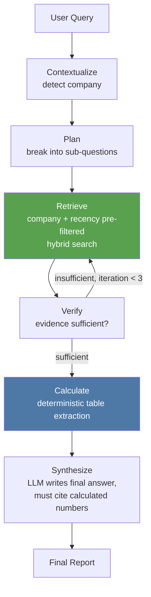
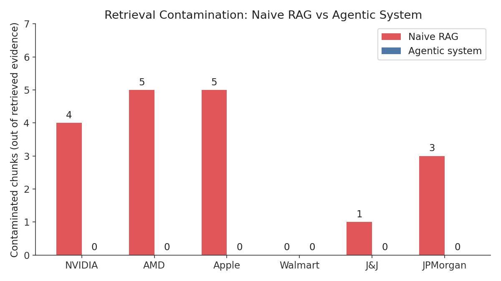
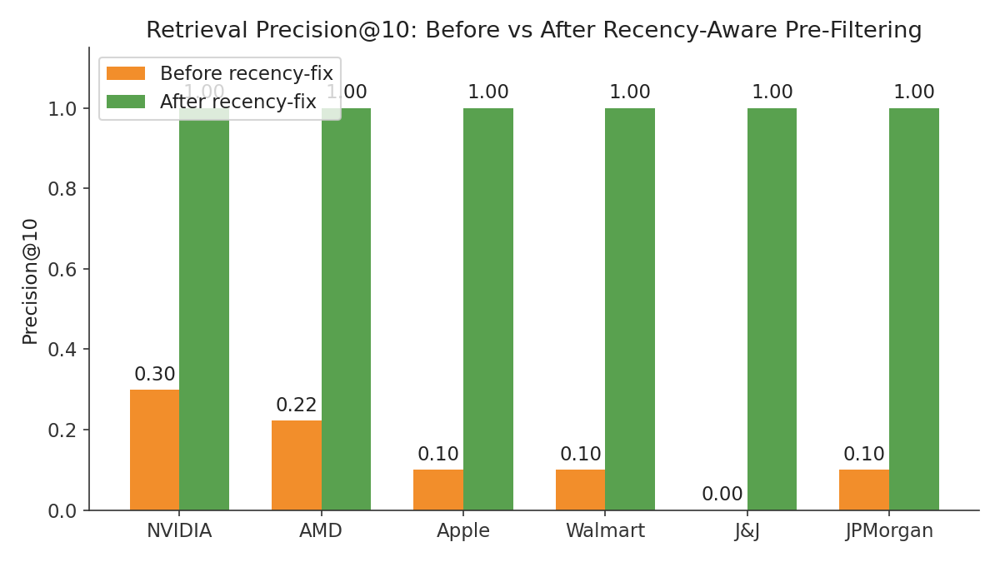
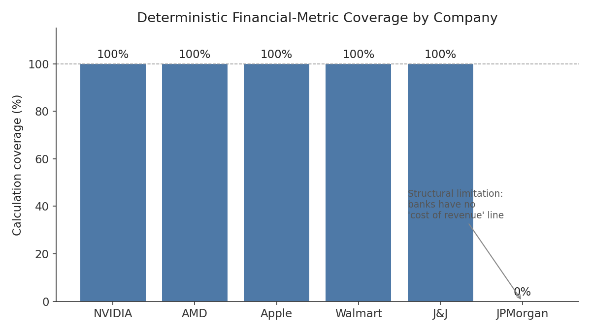

# Open Financial Analyst

An agentic RAG system that answers financial-research questions across multiple companies by combining **hybrid retrieval** over SEC filings with **deterministic table-extraction** for numbers — so the LLM narrates and explains, but never invents a revenue or margin figure.

Built with **LangGraph**, **FAISS + BM25 hybrid search**, and **Gemini (via LangChain)**, tested against 6 companies across 5 sectors (semiconductors, consumer tech, retail, healthcare, banking) using live SEC EDGAR filings.

---

## Why this exists

Most "chat with your filings" demos are a single retrieval pass + an LLM asked to be careful. That falls apart in two predictable ways: the retriever pulls in the wrong company's numbers, and the LLM does arithmetic on scraped table text it doesn't actually understand. This project treats both as engineering problems, not prompting problems — and has the eval numbers to show what changed as a result.

---

## Architecture



**Key design choice:** the `Calculate` node never asks the LLM for a number. Revenue and cost-of-revenue are pulled from parsed HTML tables with keyword matching, a same-table (or nearby-table) consistency check, and a sanity-check ratio filter (cost must be 10–95% of revenue) that rejects mismatched rows before they ever reach the LLM. The LLM only explains numbers that were already computed deterministically.

---

## Key features

- **Hybrid retrieval** — dense (FAISS, `bge-small-en-v1.5`) + BM25, fused with Reciprocal Rank Fusion
- **Company + recency + doc-type pre-filtering** — the candidate pool is narrowed *before* ranking, not after, so top-k slots are never wasted on the wrong company or a stale filing
- **Deterministic financial calculations** — table-level extraction with a same-table/nearby-table consistency check and a sanity-check ratio filter
- **Keyword-first, LLM-fallback-second extraction** — static keyword matching handles most filings for free; when a company uses non-standard terminology (e.g. "Sales to customers" instead of "Revenue"), an LLM classifies the correct label **once**, then the result is cached permanently for the rest of the run
- **Agentic verify-loop** — retrieval repeats (up to 3 iterations) if the LLM judges evidence insufficient
- **Evaluation suite** — contamination rate, calculation coverage, citation groundedness, precision/recall@k, naive-vs-agentic baseline comparison, cost/latency tracking

---

## Bugs found and fixed

This project's evaluation suite caught six distinct, non-trivial bugs during development. Each is a short case study in why "it looks right" isn't the same as "it is right":

| # | Bug | Root cause | Fix |
|---|-----|------------|-----|
| 1 | Retrieval returned evidence from the wrong company | `retrieve_node` never filtered by company — it ranked across all companies' chunks | Added an explicit company filter before ranking |
| 2 | One company's calculations were always empty | Cost-of-revenue keyword list didn't match that company's actual filing terminology ("cost of sales" vs "cost of revenue") | Broadened keyword list |
| 3 | Calculated gross margin used mismatched numbers | Revenue and cost were pulled from two unrelated tables in the same document | Added a same-table match requirement |
| 4 | Some 10-Ks still failed after fix #3 | A single income statement is sometimes split across multiple adjacent `<table>` tags | Relaxed the match to a small table-index window |
| 5 | A new company's revenue never matched any keyword | That company's filings use non-standard terminology no static list anticipated | Added an LLM fallback that classifies unmatched labels once, then caches the result permanently |
| 6 | "Most recent" queries sometimes retrieved stale filings | Retrieval is purely semantic — it has no concept of recency, only similarity | Added recency/doc-type intent detection that pre-filters the candidate pool to the correct period before ranking |

---

## Evaluation results

### Retrieval contamination — naive RAG vs agentic system



A minimal baseline (single retrieval pass, no company filter, no deterministic calculation) pulled evidence from the wrong company in nearly every case. The agentic system had **zero** contaminated chunks across all 6 companies and 12 test queries.

### Precision@10 — before vs after recency-aware pre-filtering



Before the recency fix, "most recent" queries retrieved a mix of chunks from old and new filings (avg precision@10 ≈ 0.14). After pre-filtering the candidate pool by detected recency/doc-type intent, precision@10 reached **1.0 across all 6 companies** in production evaluation — every retrieved chunk came from the correct target filing.

### Deterministic calculation coverage



5 of 6 companies achieve full deterministic coverage. JPMorgan Chase is the one deliberate exception — see [Known Limitations](#known-limitations).

### Summary table

| Metric | Naive RAG | Agentic system |
|---|---|---|
| Retrieval contamination (18 evidence chunks checked) | 18 | **0** |
| Deterministic-calc coverage | 0/6 queries | **5/6** queries |
| Citation groundedness | 100% | 100% |
| Precision@10 (recency queries, production retriever) | 0.14 avg | **1.0 avg** |

---

## Known limitations

Being upfront about what this system doesn't do is as important as what it does:

- **No support for financial-services companies.** Banks (e.g. JPMorgan) don't have a "cost of revenue" line — their income statement is structured around net interest income and noninterest revenue instead. The deterministic gross-margin calculation assumes a standard COGS-based income statement and correctly reports "no match" rather than forcing a meaningless number.
- **Recall is capped by `k`, not by retrieval quality.** Some filings have 30–70+ chunks; retrieving the top 10 can never reach recall = 1.0 by construction. Precision is the more meaningful metric here.
- **Company detection is keyword-based**, not a trained entity-resolution model. It works for the 6 companies tested but won't generalize to a query that doesn't mention the company name or ticker.
- **Golden-set numeric accuracy is not yet independently verified** against hand-checked filing values — this is the natural next step (see Future Work).

---

## Tech stack

- **Orchestration:** LangGraph (agentic graph with conditional retrieve→verify loop)
- **LLM:** Gemini (`gemma-4-31b-it`) via `langchain-google-genai`
- **Retrieval:** FAISS (dense, `bge-small-en-v1.5`) + `rank_bm25` (sparse), fused with Reciprocal Rank Fusion
- **Data source:** SEC EDGAR (`sec-edgar-downloader`), parsed with BeautifulSoup
- **Companies tested:** NVIDIA, AMD, Apple, Walmart, Johnson & Johnson, JPMorgan Chase

---

## Repository structure

```
open-financial-analyst/
├── README.md
├── pyproject.toml            # pip-installable package (src layout)
├── requirements.txt          # convenience install without editable mode
├── .gitignore
├── src/
│   └── ofa/
│       ├── __init__.py       # intentionally minimal — see module docstring
│       ├── config.py         # company universe, secrets loading
│       ├── llm_utils.py      # response parsing, retry-with-backoff, call-stats
│       ├── ingestion.py      # SEC EDGAR download + HTML/table parsing
│       ├── chunking.py       # context-prefixed chunking
│       ├── retrieval.py      # HybridRetriever (FAISS + BM25 + RRF), recency detection
│       ├── extraction.py     # deterministic table extraction + LLM-fallback learner
│       ├── agent.py          # AgentState, LangGraph nodes, graph builder
│       └── pipeline.py       # FinancialAnalystPipeline — top-level orchestration
├── tests/
│   ├── test_extraction.py    # pure unit tests, no network/LLM required
│   └── test_agent.py         # company-filter + recency-prefilter logic tests
├── eval/
│   └── run_eval.py           # CLI: contamination, coverage, groundedness, precision/recall, cost/latency
├── notebooks/
│   └── open_financial_analyst.ipynb   # original exploration notebook (kept for reference)
└── docs/
    └── images/
        ├── contamination_comparison.png
        ├── precision_recall_comparison.png
        └── coverage_by_company.png
```

**Design note:** `src/ofa/__init__.py` deliberately does not import `pipeline.py` at package load time — `pipeline.py` pulls in `langchain-google-genai`, `sentence-transformers`, and `faiss`, which are unnecessary for testing the pure extraction/agent logic. This is why `tests/` can run without those installed. Import the pipeline explicitly: `from ofa.pipeline import FinancialAnalystPipeline`.

---

## Setup

```bash
# editable install (recommended)
pip install -e .

# or, without installing the package
pip install -r requirements.txt
```

Requires a Gemini API key and a SEC EDGAR contact email (used as the required `User-Agent` for `sec-edgar-downloader`):

```bash
export GEMINI_API_KEY="..."
export SEC_EDGAR_EMAIL="you@example.com"
```

### Run the pipeline

```python
from ofa.pipeline import FinancialAnalystPipeline

pipeline = FinancialAnalystPipeline()
pipeline.setup()  # download + parse + index + compile

result = pipeline.run_query("What is AMD's revenue trend recently?")
print(result["final_report"])
```

### Run the evaluation suite

```bash
python -m eval.run_eval
```

### Run tests

```bash
pytest tests/ -v
```

Tests use synthetic data and mocked LLM/retriever objects — no network access, no API keys, and no model downloads required.

### Explore in the original notebook

`notebooks/open_financial_analyst.ipynb` contains the full development history — ingestion → retrieval → agent → evaluation — as it was built and debugged interactively. Useful for following the reasoning behind each fix; the `src/ofa/` package is the clean, tested, importable version of the same logic.

---

## Future work

- Independently verify a golden set of filing values against calculated output to report a real numeric-accuracy percentage
- Extend deterministic extraction to financial-services income-statement structures (net interest income / noninterest revenue)
- Replace keyword-based company detection with a lightweight entity-resolution step
- Wrap the pipeline in a minimal API/UI for interactive use outside the notebook
- Add CI (GitHub Actions) to run `pytest tests/` on every push
